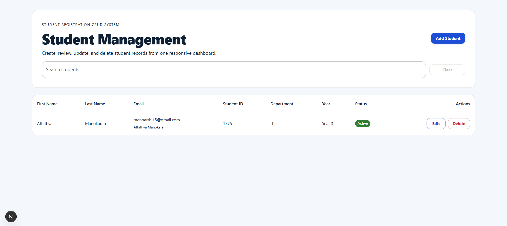
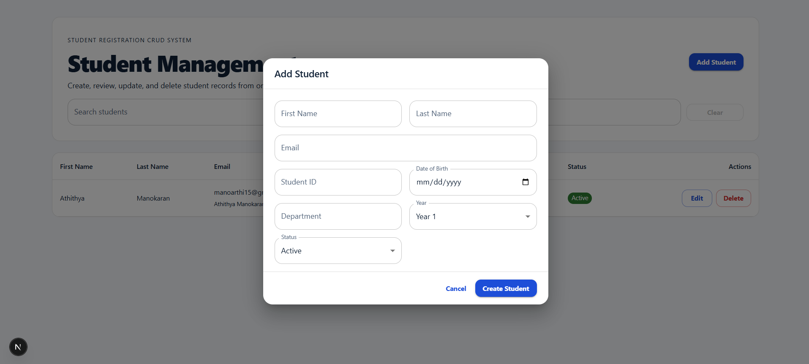
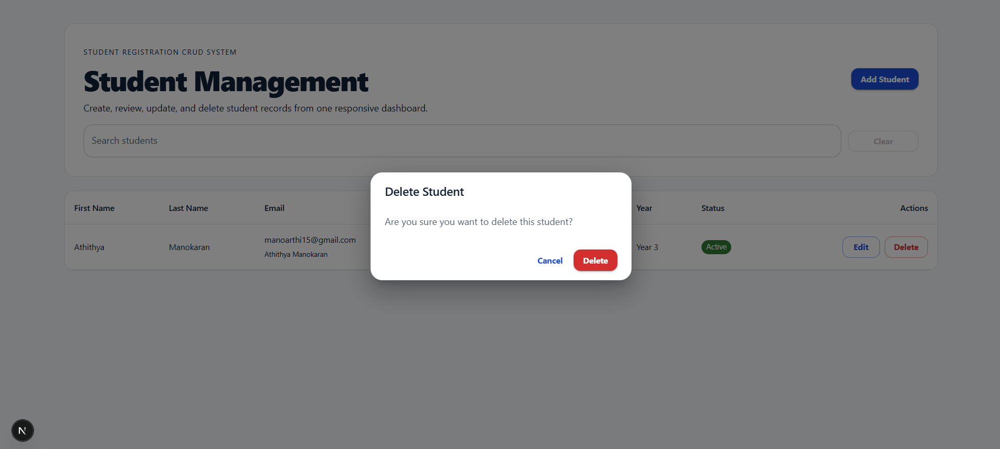
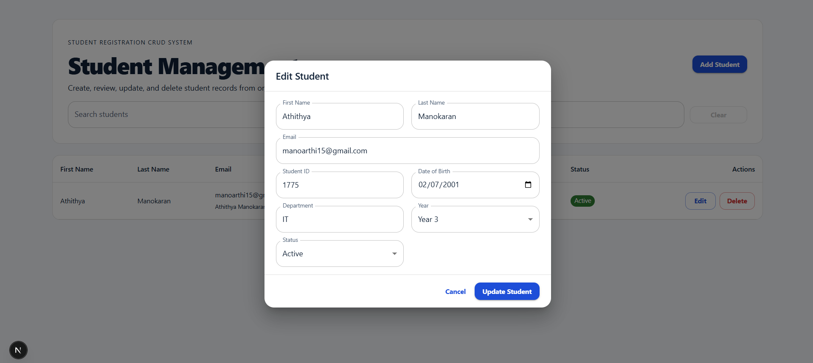

# Student Registration System

A clean monorepo starter for a student registration platform.

## Structure

- `frontend/`: Next.js app router UI for student management
- `backend/`: NestJS API with a student module, repository, and tests

## Installation

Install all dependencies from the repository root:

```bash
yarn install
```

## Run Locally

Start the frontend:

```bash
yarn dev:frontend
```

Start the backend:

```bash
yarn dev:backend
```

The frontend expects the API at `http://localhost:3001` by default.

## Screenshots

## Dashboard



## Add Student



## Delete Student 



## Edit Student




